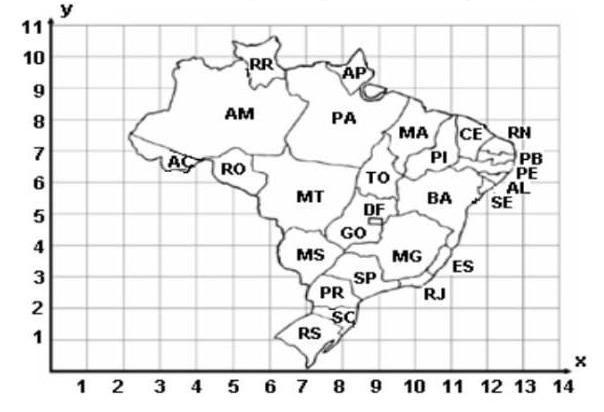

# Grafos 1 - Min Tree Net

Este projeto implementa uma **Árvore Geradora Mínima para comunicação de clusters** em Python, com o objetivo de construir um **fazer com que todos os nós recebam uma mensagem por um custo mínimo**.  
A partir de uma lista de servidores, com suas devidas posições, aplicamos o algoritmo de Kruskal, afim de traçar o melhor caminho, ou seja, de custo mínimo para a transmissão de uma mensagem para todos os servidores. Levamos em consideração a comunicação sendo iniciada por um nó da rede, e depois retransmitindo a mensagem para seus vizinhos, de acordo com o algoritmo de Kruskal, motivado pela melhoria da comunicação. 

---

## Tecnologias Utilizadas
- [Python 3.10+](https://www.python.org/)
- Algoritmo de árvore geradora mínima de **Kruskal**


##  Como Executar

### 1. Instalar dependências
Recomendado criar um ambiente virtual:
```bash
python3 -m venv venv
source venv/bin/activate
pip install matplotlib networkx numpy
```

### 2. Rodar o algoritmo
Exemplo com os servidores de testes:
```bash
make
```
Isso gera a árvore mínima para encaminhamento de uma mensagem. 

Cabe lembrar que é possível alterar o arquivo JSON para adicionar mais servidores. Utilizamos como exemplo e guia o plano cartesiano presente na Figura 1. 

<p align="center">
  <b>Figura 1 – Plano cartesiano no mapa do Brasil</b><br>
  
</p>

## Autores

Projeto desenvolvido como trabalho da disciplina de **Projeto de Algoritmos**.

Dupla responsável: 

- [Júlia Fortunato](https://github.com/julia-fortunato)  
- [Maurício Ferreira](https://github.com/mauricio_araujoo)  

## Vídeo de apresentação
[Link para o vídeo](https://www.youtube.com/watch?v=hENF3_Km_vA)